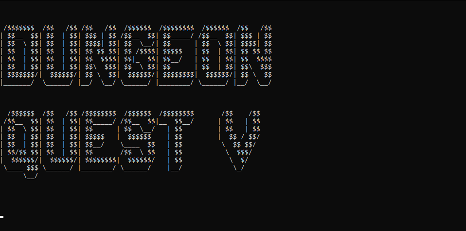
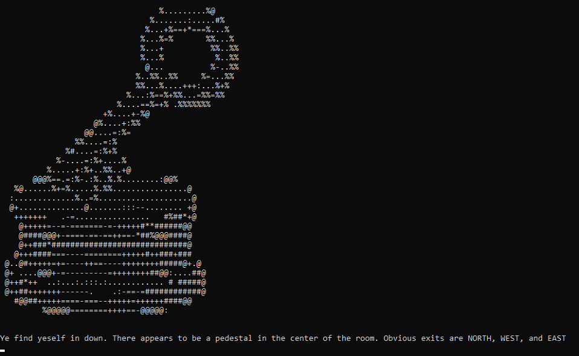

# CPP Final Project - Text-Based Adventure Game

A short text-based adventure game inspired by the classic games on [homestarrunner.com](https://www.homestarrunner.com/). Navigate the dungeon, solve puzzles, and find the exit!

---

## Screenshots




---

## Running the Program

### Requirements
- A C++ compiler (e.g., g++, Visual Studio, or Code::Blocks)
- Project source files, including headers

### Steps
1. Open your terminal or IDE.
2. Navigate to the folder containing the source files.
3. Compile the program:

```bash
g++ -o adventure main.cpp other_files.cpp
